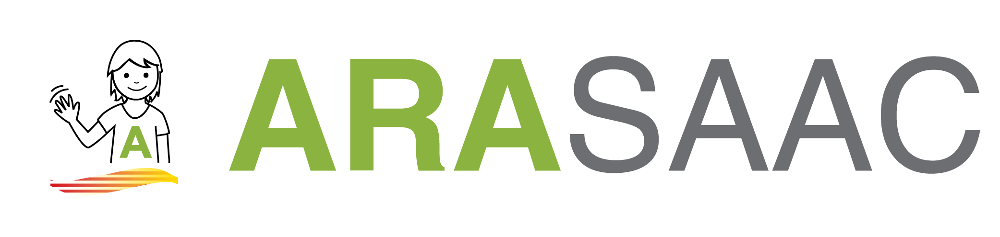

# PyTEA Pi
**PyTEA Pi** es una aplicación diseñada para facilitar la comunicación de personas con Trastorno del Espectro Autista (TEA) o Trastorno Específico del Lenguaje (TEL). La aplicación utiliza pictogramas organizados por categorías, acompañados de locuciones, para permitir la formación de frases de manera intuitiva y accesible.

---

## 🚀 Características
- **Interfaz gráfica adaptada**: Navegación intuitiva basada en pictogramas categorizados.
- **Feedback visual y auditivo**: Los pictogramas seleccionados generan frases visibles y locuciones claras.
- **Menú estructurado**: Hasta 20 categorías de pictogramas organizadas por colores y temáticas.
- **Independencia de hardware**: Compatible con cualquier sistema operativo basado en Linux.
- **Código modular**: Diseño extensible para futuras funcionalidades y mejoras.

---

## 📂 Estructura del proyecto
```plaintext
PyTEA_Pi/
├── assets/               # Recursos estáticos como el logo.
├── audio/                # Archivos de audio organizados por categorías.
├── data/                 # Configuración y mapeo de datos.
├── pictograms/           # Pictogramas organizados por categorías.
├── scripts/              # Scripts para despliegue y automatización.
├── src/                  # Código fuente principal de la aplicación.
├── tests/                # Tests automatizados.
├── README.md             # Documentación del proyecto.
├── requirements.txt      # Lista de dependencias del proyecto.
└── main.py               # Archivo principal para ejecutar la aplicación.
```

---

## 🛠️ Instalación
### Requisitos previos
- **Sistema operativo:** Raspberry Pi OS o cualquier distribución basada en Linux.
- **Python:** Versión 3.7 o superior.
- Dependencias especificadas en `requirements.txt`.

### Instrucciones
1. Clona el repositorio:
   ```bash
   git clone git@github.com:jcarloswg264/PyTEA_Pi.git
   cd PyTEA_Pi
   ```
2. Crea un entorno virtual y actívalo:
   ```bash
   python3 -m venv env
   source env/bin/activate
   ```
3. Instala las dependencias:
   ```bash
   pip install -r requirements.txt
   ```
4. Ejecuta la aplicación:
   ```bash
   python main.py
   ```

---

## 🖼️ Uso
1. Al iniciar la aplicación, se muestra una pantalla con categorías de pictogramas.
2. Selecciona una categoría para visualizar los pictogramas disponibles.
3. Haz clic en un pictograma para reproducir su locución.

---

## ⚖️ Consideraciones legales
### Uso de pictogramas de ARASAAC
Este proyecto utiliza pictogramas proporcionados por **ARASAAC (https://arasaac.org)**, una fuente gratuita de recursos gráficos destinados a personas con necesidades comunicativas específicas.

**Condiciones de uso:**
- **Uso no comercial:** Los pictogramas se emplean exclusivamente para fines educativos, terapéuticos o personales, sin ningún propósito comercial.
- **Reconocimiento de autoría:** ARASAAC y el Gobierno de Aragón son reconocidos como los autores y propietarios de los pictogramas utilizados.
- **No alteración:** Los pictogramas no han sido modificados, salvo autorización expresa.

Para más información sobre las condiciones de uso, visita la página oficial de ARASAAC: [Condiciones de uso de ARASAAC](https://arasaac.org/terms-of-use).

Si deseas utilizar los pictogramas para fines comerciales o necesitas modificar los recursos, es obligatorio obtener autorización expresa de ARASAAC y del Gobierno de Aragón.

---

## 🧩 Contribución
¡Tu ayuda es bienvenida! Si deseas contribuir:
1. Haz un fork del repositorio.
2. Crea una rama para tu funcionalidad o corrección:
   ```bash
   git checkout -b feature/nueva-funcionalidad
   ```
3. Realiza tus cambios y haz un commit:
   ```bash
   git commit -m "Añadida nueva funcionalidad"
   ```
4. Haz un push a tu rama y abre un pull request.

---

## 📜 Licencia
Este proyecto está licenciado bajo la **[MIT License (Modificada para prohibir uso comercial)](LICENSE)**.

### Condiciones principales de la licencia MIT personalizada:
1. **Uso no comercial**: El software no puede ser utilizado con fines comerciales sin autorización explícita del autor.
2. **Atribución**: Debe reconocerse a **Jose Carlos Wittmann** como el autor del proyecto en cualquier uso, copia o distribución.
3. **Permiso para uso comercial**: Para usar este software en proyectos comerciales, se debe obtener autorización previa.

El texto completo de la licencia está disponible en el archivo [LICENSE](LICENSE).

---

Para consultas sobre el uso del software, puedes contactarme directamente.

---

## ⚠️ Consideraciones legales sobre los pictogramas de ARASAAC
Este proyecto utiliza pictogramas proporcionados por **ARASAAC (https://arasaac.org)**, una fuente gratuita de recursos gráficos destinados a personas con necesidades comunicativas específicas.



### Condiciones de uso de los pictogramas:
- **Uso no comercial**: Los pictogramas se emplean exclusivamente para fines educativos, terapéuticos o personales. **No se permite su uso con fines comerciales** sin autorización expresa de ARASAAC.
- **Reconocimiento de autoría**: ARASAAC y el Gobierno de Aragón deben ser reconocidos como los autores de los pictogramas en cualquier uso o distribución.
- **No alteración**: Los pictogramas no pueden ser modificados sin autorización expresa.

Puedes consultar las condiciones completas en la página oficial de ARASAAC: [https://arasaac.org/terms-of-use](https://arasaac.org/terms-of-use).

---

## 🙌 Agradecimientos
- A **ARASAAC** por proporcionar pictogramas y recursos gratuitos que mejoran la comunicación.
- A la comunidad de Python y Kivy por su soporte y documentación.

---
